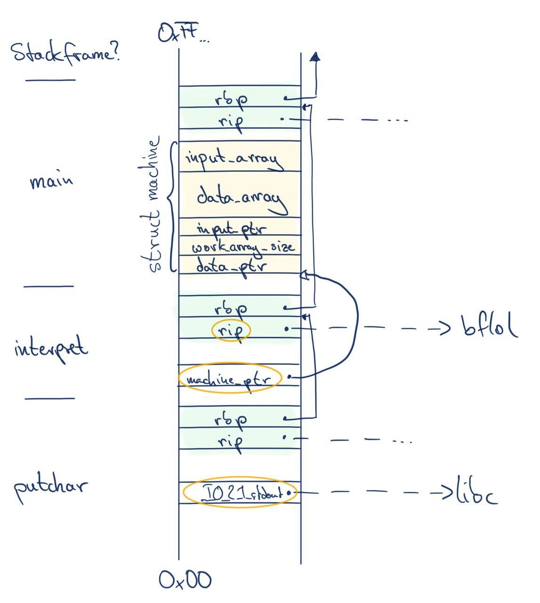

bflol
=====

This challenge was part of the CyberSecurityRumble Germany 2020.

Challenge description:

```
bf! lol!

nc chal.cybersecurityrumble.de 19783
```

* Points: 300 + 186 Points
* Solves: 20
* Tag: pwn
* Given files: `bflol`

I solved this challenge for FAUST after less than 5 hours; FAUST was the second team to solve this challenge.

## Getting started
Several mitigation techniques are enabled in this binary:
```
    Arch:     amd64-64-little
    RELRO:    Partial RELRO
    Stack:    Canary found
    NX:       NX enabled
    PIE:      PIE enabled
```

I first loaded the binary in a decompiler; the binary is not stripped.
The main function initializes a few stack variables (`int data[3]`, `char data_array[30000]`, and `char input_array[1000]`), reads input to the second char array (up to 1000 characters to `input_array`), and calls the `interpret` function.
Given the name of this challenge (`bflol`) one might assume that this is an implementation of the [brainfuck language](https://en.wikipedia.org/wiki/Brainfuck).
If we look at `interpret`, we find out that this is actually the case.
It loops over the input provided by the user and interprets it as brainfuck code where `data[0]` is the data pointer (to `data_array`) and `data[2]` is the instruction pointer (to `input_array`).
Execution continues until the instruction pointer points to a null byte.

This is basically everything one needs to exploit this binary, since there are no checks for the end of the arrays.

The stack content can be described as a struct:
```C
struct machine {
	int data_ptr;  // Data pointer
	int work_array_size;  // Size of data_array; not used
	int input_ptr;  // Instruction pointer
	char data_array[30000];
	char input_array[1000];
};
```

## Approach
The **first** goal is to get address leaks for stack, libc, and the `bflol` binary itself.
You can see the stack layout in the following image.



I decreased the `data_ptr` (with `<`) to point to the data before the actual `struct machine` on the stack.
This is possible since there are no boundary checks.
With the `.` character one can print the byte referenced by the `data_ptr` (Note that the `data_ptr` is interpreted relative to the `data_array`).

For the leaks I printed the `rip` (`bflol`), a `machine_ptr` (stack), and a reference to `_IO_2_1_stdout` (libc).
All three addresses are marked in the image with orange circles.
The `machine_ptr` is part of the stack frame of `interpret`.
The `_IO_2_1_stdout` reference is part of the stack frame of `putchar`, which is called when a `.` character is processed.
The corresponding attack vector looks like this: `'<'*12 + '<.'*8 + '<'*8 + '<.'*8 + '<'*48 + '<.'*8`.
The `'<'*x` moves the `data_ptr` to the next address and the `'<.'*8` prints the address on `stdout`.

The **second** step is moving the `data_ptr` to the `rip` of the `main` stack frame such that we can place a rop chain.
First, I moved the `data_ptr` to the beginning of the `data_array` (`'>'*92`) and incremented the first byte (`'+'`).
Note, that the entire `data_array` is initialized with null bytes.
Next, I added a `\xff` byte to the input which is ignored by the bf interpreter.
This is necessary for the loop: `'[->+]'`.
With the loop we move the `data_ptr` to the `\xff` byte.
How does this work?
The loop decrements the current value, increments the `data_ptr`, and adds 1 to the byte pointed to by `data_ptr`.
If the byte is then 0, the loop ends: This is exactly the case, if the byte was previously `\xff`.
With `'>' + '[>]'` (another loop) we can then move the `data_ptr` to the end of our `input_array` (if we almost fill it until the end).
To move the `data_ptr` to the `rip` of the main stack frame we add `'>'*24`.

The overall attack vector is: `'>'*92 + '+' + '\xff' + '[->+]' + '-' + '>' + '[>]' + '>'*24`.

The **third** step is reading in the rop chain.
There is one pitfall: If the `','` instruction reads a null byte, this is interpreted as the start of a loop.
This is not the default case for the bf language but might be due to an (intentionally?) missing `break` in the switch-case statement in the `interpret` function.
Since we only need a few stack entries for the rop chains and those entries only contain null bytes in the two most significant bytes, this is not an issue.
We only read the 6 relevant bytes and skip the two null bytes (`',>'*6 + '>'*2` for every entry).

After that we only need to fill the `input_array` to a deterministic length for the loop in the second step.

Given the address leaks we can do the **fourth** step: [fingerprinting](https://libc.rip/) the remote libc.
This is as simple as reading `.got` entries from our binary: `ropchain = [ pop_rdi_ret, bflol.got['getchar'], bflol.plt['puts'] ]`.
I leaked the addresses of `getchar` and `putchar` which was enough to identify the remote libc.

This is enough for the **fifth** step: RCE.
Now, just replace the ropchain with a one gadget: `ropchain = [ libc.address + 0x4484f ]`.

## Exploit

An exploit is available in [`x.py`](./x.py).

Just run it:
```
$ ./x.py remote
[*] '/path/to/bflol'
    Arch:     amd64-64-little
    RELRO:    Partial RELRO
    Stack:    Canary found
    NX:       NX enabled
    PIE:      PIE enabled
[*] '/path/to/libc6_2.28-10_amd64.so'
    Arch:     amd64-64-little
    RELRO:    Partial RELRO
    Stack:    Canary found
    NX:       NX enabled
    PIE:      PIE enabled
[+] Opening connection to chal.cybersecurityrumble.de on port 19783: Done
[*] binary @ address 0x000055d3d53fb000
[*] libc @ address 0x00007f58f49b9000
[*] stack leak: 0x00007fffa5c564d0
[*] Launching shell
[*] Switching to interactive mode
$ cat flag.txt
CSR{GuteArb3itMitDemGehirnFick}
$
```
